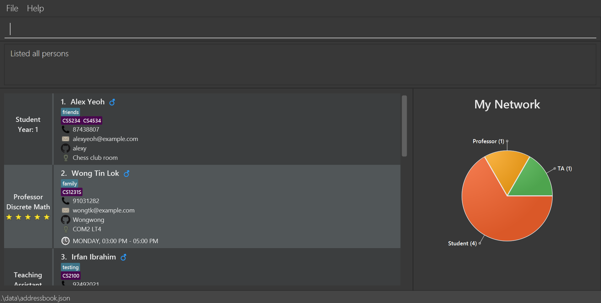
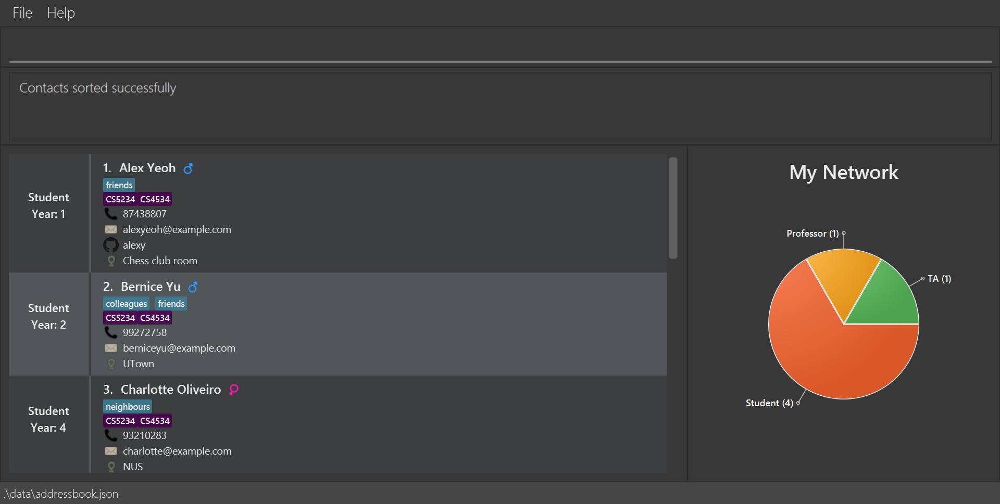
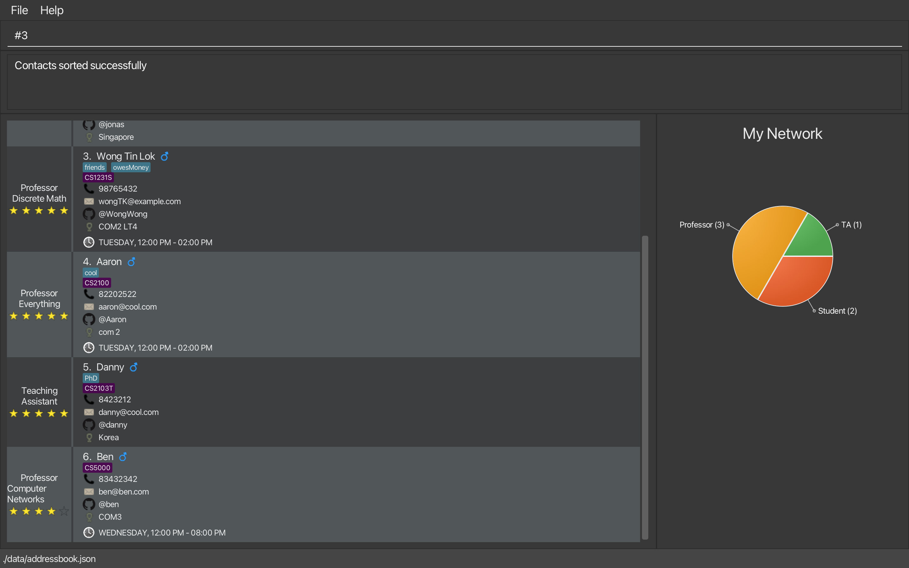
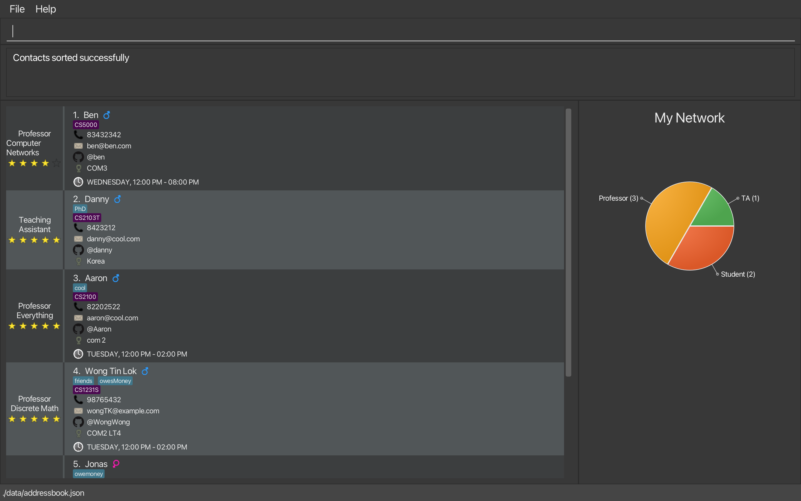

SOConnect is a **desktop application for SOC students to easily find their peers, TAs and profs**.
Since it is designed for SOC students, it is **optimized for use via a Command Line Interface (CLI)**
but it also has a Graphical User Interface for simpler and quicker task.

## Table of Contents
1. [About the User Guide](#1-about-the-user-guide)
    - [1.1. Parameters](#11-parameters)
    - [1.2. Format](#12-format)
2. [Quick Start](#2-quick-start)
3. [Features](#3-features)
    - [3.1 Add-Related Commands](#31-add-related-commands)
        * [3.1.1 Add new Student Contact](#311-add-student)
        * [3.1.2 Add new Prof Contact](#312-add-prof)
        * [3.1.3 Add new Teaching Assistant (TA)](#313-add-ta)
    - [3.2 Editing-Related Commands](#32-editing-related-commands)
        * [3.2.1 Delete a person](#321-delete-person)
        * [3.2.2 Editing contact](#322-edit-contact)
    - [3.3 Searching-Related Commands](#33-searching-related-commands)
        * [3.3.1 Locate contact](#331-locate-contact)
        * [3.3.2 List contact](#332-list-contact)
        * [3.3.3 Sort contact](#333-sort-contact)
          * [3.3.3.1 Sort by name](#3331-sort-by-name)
          * [3.3.3.2 Sort by moduleCode](#3332-sort-by-moduleCode)
    - [3.4 Github-Related Commands](#34-github-related-commands)
        * [3.4.1 Open a person's github profile page](#341-opening-a-persons-github-profile-page-github)
    - [3.5 Fast Template Command](#35-fast-template-command)
    - [3.6 Sharing-Related Commands](#36-share-commands)
        * [3.6.1 Export Contact](#361-export-contact)

--------------------------------------------------------------------------------------------------------------------
# 1. About the User Guide

This section will explain the parameters and the format of commands.

## 1.1 Parameters

| Prefix | Parameter    | Meaning                                         |
|--------|--------------|-------------------------------------------------|
| n/     | NAME         | Name of person                                  |
| p/     | PHONE NUMBER | Phone number of person                          |
| g/     | GENDER       | Gender of person (STRICTLY FEMALE OR MALE)      |
| e/     | EMAIL        | Email address of person                         |
| m/     | MODULE       | Module that person is participating in          |
| t/     | TAG          | Tag person (i.e tag as friend)                  |
| r/     | RATING       | Rate person (on a scale of 0 to 5)              |
|    | INDEX        | Index of item in the recent displayed item list |

## 1.2 Format

* All prefixes must be preceded by a space. 
  e.g <code> t/</code>, <code> g/</code>

* All commands are **lower-sensitive**. 
  e.g. `Add` will **not** be recognised as a valid syntax.

* Words in `UPPER_CASE` are the parameters to be **supplied by you**. 
  e.g. in `student e/EMAIL`, `EMAIL` is a parameter which can be used as `student e/e123@u.nus.edu` to create a student with email e123@u.nus.edu

* Items in **square brackets are optional**. 
  e.g `student n/NAME [t/TAG]` can be used as `student n/John` or as `student n/John t/friend`.

* `INDEX` **must be a positive integer** e.g. 1, 2, 3... 
  e.g. the `INDEX` in `delete INDEX` and `edit INDEX` must be a positive integer that is present in the
  corresponding lists e.g. `delete 1` `edit 2`.

* Parameters can be in **any order**. The only exception is if one of the parameter is an INDEX, in this case
  , **INDEX must be the second parameter**.  
  e.g. if the command specifies `student n/NAME e/EMAIL`, then `student e/EMAIL n/NAME` is also acceptable.
  e.g. if the command specifies `edit INDEX n/NAME`, then `edit n/NAME INDEX` is not acceptable.

  

--------------------------------------------------------------------------------------------------------------------
# 2. Quick Start

1. Ensure you have Java `11` or above installed in your Computer.

1. Download the latest `SOConnect.jar` from [here](https://github.com/AY2223S1-CS2103T-W08-3/tp).

    1. **Double-click** the file to start the app or  using **CLI** and type `java -jar SOConnect.jar`. The GUI similar to the below should appear in a few seconds. Below is an UI mockup.
       

1. Refer to the [Features](#2-features) below for details of each command.

--------------------------------------------------------------------------------------------------------------------
# 3. Features

## 3.1 Add-Related Commands
The Add-Related commands include `student`, `prof` and `ta`. These are the commands related to adding a new person to the database.

### 3.1.1 Adding a new Student Contact: `student`

Adds a new Student contact to your contacts list.

Format: `student n/NAME [y/YEAR] m/MODULE_CODE... p/PHONE e/EMAIL g/GENDER [t/TAG]... [l/LOCATION] git/GITHUB_USERNAME`

:bulb: **Tip:**
A student can have multiple module codes and tags.

Examples:
* `student n/John Doe y/1 m/CS4226 m/CS5242 p/98765432 e/JohnD@example.com g/M t/friends t/owesMoney l/UTown Residences git/johnnyd`
* `add n/Betsy Crowe t/friend m/CS2100 e/betsycrowe@example.com a/Newgate Prison p/1234567 t/criminal`

### 3.1.2 Add a new Professor Contact: `prof`

Adds a new Professor contact to your contacts list.

Format: `prof n/NAME m/MODULE_CODE [s/SPECIALISATION] p/PHONE e/EMAIL g/GENDER [t/TAG]... l/LOCATION git/GITHUB_USERNAME [r/RATING]`

:bulb: **Tip:**
When adding a Professor, you can enter multiple module codes in the same command, but only the last module code will be taken.

Examples:
* `prof n/Hartin Menz m/CS1101s s/Discrete Math p/98765432 e/HMenz@example.com g/M t/friends l/COM2 LT4 git/hartinmenz r/5 o/2-12:00-2`
* `prof n/Koro Sensei m/CS3230 p/98663357 e/KoroSensei@gmail.com g/M t/wanted git/senseikoro`

### 3.1.3 Add a new TA Contact: `ta`

Adds a new Teaching Assistant contact to your contacts list.

Format: `ta n/NAME m/MODULE_CODE p/PHONE e/EMAIL g/GENDER [t/TAG]... l/LOCATION git/GITHUB_USERNAME [r/RATING]`

:bulb: **Tip:**
Similar to professor, when adding a Teaching Assistant, you can enter multiple module codes in the same command, but only the last module code will be taken.

Examples:
* `ta n/Alice Doe m/CS2100 p/98765432 e/AliceD@example.com g/F t/friends t/owesMoney l/COM1-0203 git/alicyD r/5`
* `ta n/Pablo Escobar m/CS2040 p/99982344 e/Pablo@hotmail.com g/M t/entrepreneur git/pabbyescobar` 

--------------------------------------------------------------------------------------------------------------------
## 3.2 Editing-Related Commands
### 3.2.1 Delete a person

Deletes one or more contacts from the contacts list.

Format: `delete INDEX1 INDEX2...`

* Deletes the person(s) at the specified `INDEX`.
* Multiple contacts can be deleted at once by entering multiple indexes.
* The indexes **must be a positive integer** 1, 2, 3...
* The order of the indexes does not matter as long as they are valid i.e. they are not out of bounds.

Example:
* `Delete 1 2 3`

### 3.2.2 Edit contact
[coming soon]

--------------------------------------------------------------------------------------------------------------------
## 3.3 Searching-Related Commands
### 3.3.1 Locate contact
[coming soon]
### 3.3.2 List contact
[coming soon]
### 3.3.3 Sort contact

Sort the contact list in either ascending `A-Z` or descending `Z-A` order by name or module code.

#### 3.3.3.1 Sort by name

Sort the contact list by name in either ascending `A-Z` or descending `Z-A` order.

Format: `sort A-Z n/name`

Before executing the above command: 
After executing the command: 
NOTE: contact sorted by name in `A-Z` order

Format: `sort Z-A n/name`

After executing the command: 
NOTE: contact sorted by name in `Z-A` order

#### 3.3.3.2 Sort by moduleCode

Sort the contact list by moduleCode in either ascending `A-Z` or descending `Z-A` order.

Format: `sort Z-A m/moduleCode`

After executing the above command: 
NOTE: moduleCode sorted in order of CS1231S>CS2100>CS2103T>CS5000, lower level modules will appear higher.

Format: `sort A-Z m/moduleCode`

After executing the above command: 
NOTE: moduleCode sorted in order of CS5000>CS2103T>CS2100>CS1231S, higher level modules will appear higher.

--------------------------------------------------------------------------------------------------------------------
## 3.4 Github-Related Commands
### 3.4.1 Opening a person's github profile page: `github`

Opens the github profile page associated to the specified person in the address book.

Format: `github INDEX`
* Opens the github profile page associated to the person at the specified `INDEX'
* The index refers to the index number shown in the displayed person list.
* The index **must be a positive integer** 1, 2, 3, …

Example command: `github 1`

--------------------------------------------------------------------------------------------------------------------
## 3.5 Fast Template Command

Returns a template with all the fields of a Person on the CLI.

Format: `tt PERSON`
* PERSON can be `prof`, `student`, or `ta`.

Example:
`tt prof` -> the template `prof n/ m/ s/ p/ e/ g/ t/ l/ r/ o/` will be on the CLI.

`tt student` -> the template `prof n/ m/ p/ e/ g/ t/ l/ git/ y/` will be on the CLI.

--------------------------------------------------------------------------------------------------------------------
## 3.6 Sharing-Related Commands

Allow users to share the current state of their contact list.

### 3.6.1 Export Contact as CSV

User can export the current state of his/ her contact list into a CSV file.

Format: `export filename`

NOTE: filename cannot contain any of `$%&` symbols

Upon successfully exporting, users will see the CSV file:

Also the directory where the exported file is located at will be displayed:

--------------------------------------------------------------------------------------------------------------------
## FAQ

**Q**: How do I transfer my data to another Computer? 
**A**: Install SoConnect in the other computer and overwrite the empty data file it creates with the file that contains the data of your previous AddressBook home folder.

--------------------------------------------------------------------------------------------------------------------

## Command summary

| Action           | Format, Examples                                                                                                                                                                                                                                                                                                                                                                                                                                                                                                                                                |
|------------------|-----------------------------------------------------------------------------------------------------------------------------------------------------------------------------------------------------------------------------------------------------------------------------------------------------------------------------------------------------------------------------------------------------------------------------------------------------------------------------------------------------------------------------------------------------------------|
| **Add a Person** | `PERSON n/NAME p/PHONE_NUMBER e/EMAIL a/ADDRESS [t/TAG]…​`   where PERSON is `prof / student / ta`     e.g. Adding student `student n/James Ho m/CS1231 p/12345678 e/jamesho@example.com g/M t/bestfriend t/colleague l/UTown Residences git/jamesho y/2`    e.g. Adding prof `prof n/Wong Tin Lok m/CS1231S s/Discrete Math p/98765432 e/WongTK@example.com g/M t/greatVoice git/WongExample l/COM2 LT4 r/5 o/2-12:00-2`    e.g. Adding TA `ta n/Danny m/CS2103T p/67598442 e/Danny@example.com g/M t/Korean l/COM2-0204 git/DannyTA r/5` |
| **Clear**        | `clear`                                                                                                                                                                                                                                                                                                                                                                                                                                                                                                                                                         |
| **Delete**       | `delete INDEX`  e.g., `delete 3`                                                                                                                                                                                                                                                                                                                                                                                                                                                                                                                             |
| **Edit**         | `edit INDEX [n/NAME] [p/PHONE_NUMBER] [e/EMAIL] [a/ADDRESS] [t/TAG]…​`  e.g.,`edit 2 n/James Lee e/jameslee@example.com`                                                                                                                                                                                                                                                                                                                                                                                                                                     |
| **Find**         | `find KEYWORD [MORE_KEYWORDS]`  e.g., `find James Jake`                                                                                                                                                                                                                                                                                                                                                                                                                                                                                                      |
| **List**         | `list`                                                                                                                                                                                                                                                                                                                                                                                                                                                                                                                                                          |
| **Help**         | `help`                                                                                                                                                                                                                                                                                                                                                                                                                                                                                                                                                          |
| **Template**     | `tt PERSON` where PERSON is `prof / student / ta`   e.g., `tt prof`, `tt ta`, `tt student`                                                                                                                                                                                                                                                                                                                                                                                                                                                                   |
